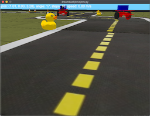

# World Model DuckieTown

This repository is an implementation of the [WorldModelsExperiments](https://github.com/hardmaru/WorldModelsExperiments)
combined with forks of [gym-duckietown](https://github.com/Bassstring/gym-duckietown)
and [baselines](https://github.com/Bassstring/baselines).

There are three gym environments provided.

1. `DreamDuck-v0`: default environment `dreamduck/envs/env.py`

   

2. `DreamDuck-v1`: world model representation `dreamduck/envs/realenv.py`

   

3. `DreamDuck-v2`: dream environment `dreamduck/envs/rnnenv.py`

   

## Getting Started

### Installation

1. Create a virtual environment with `python3 -m venv venv` and activate
  it with `source venv/bin/activate`
  - If the module is not present run `sudo apt-get install python3-venv`,
    otherwise make use of instructions for your OS

2. Install dependencies `pip install -r ./dreamduck/envs/requirements.txt`

3. Install baselines fork
  `pip install  git+https://github.com/Bassstring/baselines`

4. Install this module `pip install -e .`

## Manual Control

All three environments can be controlled manually:

### Default environment

- `python dreamduck/envs/env.py`
- Use the flag `-h` for all options

### World Model Interpretation of the real Environment

- `python dreamduck/envs/realenv.py`
- Show real observation next to world model interpretation with `--debug`

### Dreaming without real Environment

- `python dreamduck/envs/rnnenv.py`
- Make use of flag `--temp` to control uncertainty

## Training

### baselines (0.1.5)

The baselines module provide a straightforward way of training an agent
with different algorithms and settings out of the box.

With the following commands an agent is trained in the dream and evaluated
in the real environment interpreted by our world model.

- `python -m baselines.run --alg=ppo2 --env=DreamDuck-v2 --num_timesteps=2e7
  --network=mlp --num_env=2 --save_path=./models/dreamduck_rnnenv_ppo2 --log_path=train_rnnenv_logs`

- `python -m baselines.run --alg=ppo2 --env=DreamDuck-v1 --network=mlp --num_timesteps=0
  --load_path=./models/dreamduck_rnnenv_ppo2 --play`

For debugging purposes invoke baselines with following environmental variable:

- `DEBUG_BASELINES=1 python -m baselines.run --alg=ppo2 ...`

## Running headless training with xvfb

- Install xvfb `sudo apt install xvfb -y`
- Run `xvfb-run -a -s "-screen 0 1400x900x24 +extension RANDR" -- python -m
  baselines.run --alg=ppo2 --env=DreamDuck-v0 --num_timesteps=2e7
  --network=cnn_lstm --num_env=8 --save_path=./models/dreamduck_cnn_lstm_ppo2
  --log_path=train_logs`

If there are issues follow [this](https://github.com/duckietown/gym-duckietown#running-headless-and-training-in-a-cloud-based-environment-aws)
instruction.

## Authors

[Frank Röder](https://frankyroeder.de) & Shahd Safarani
