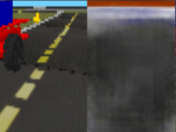
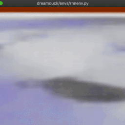

# World Model DuckieTown

This repository is an implementation of the [WorldModelsExperiments](https://github.com/hardmaru/WorldModelsExperiments)
combined with forks of [gym-duckietown](https://github.com/Bassstring/gym-duckietown)
and [baselines](https://github.com/Bassstring/baselines).

There are three gym environments provided:

1. DreamDuck-v0 default environment `dreamduck/envs/env.py`
2. DreamDuck-v1 world model compressed observation `dreamduck/envs/realenv.py`

 

3. DreamDuck-v2 dream environment `dreamduck/envs/rnnenv.py`

 

To train the world model from scratch jump to section __Training__.

## Getting Started

### Installation

1. Create a virtual environment with `python/python3 -m venv venv` and activate
  it with `source venv/bin/activate`
  - If the module is not present run `sudo apt-get install python3-venv`
  - Or make use of instructions for other OS

2. Install dependencies `pip install -r ./dreamduck/envs/requirements.txt`

3. Install baseline with custom environment import
  `pip install  git+https://github.com/Bassstring/baselines`

4. Install this module `pip install -e .`

## Manual Control

All three environment/representations are available to test out manually:

### Default environment

- `python dreamduck/envs/env.py`
- Use the flag `-h` for all options

### World Model Interpretation of the real Environment

- `python dreamduck/envs/realenv.py`

### Dreaming without real Environment

- `python dreamduck/envs/rnnenv.py`
- Make use of flag `--temp` to control uncertainty

## Run simulation with random actions

- `python dreamduck/envs/model.py realenv render`
- `python dreamduck/envs/model.py rnnenv render`

## Training

### baselines

Usage like and with `baselines===0.1.5`:

- `python -m baselines.run --alg=ppo2 --env=DreamDuck-v0 --num_timesteps=2e7 --num_env=4 --save_path=./models/dreamduck__ppo2 --log_path=train_logs`

- `python -m baselines.run --alg=ppo2 --env=DreamDuck-v0 --num_timesteps=0 --load_path=./models/dreamduck__ppo2 --play`

### CMA-ES

It is also possible to train an agent with ES like they did it in World Models:

1. `python dreamduck/envs/train.py`

## Run pre-trained model

- `python dreamduck/envs/model.py realenv render log/rnnenv.cma.16.2.json`
- `python dreamduck/envs/model.py rnnenv render log/rnnenv.cma.16.2.json`

## Pipeline

These scripts are executed in `dreamduck/envs`

1. Generate 10000 rollouts with `extract.bash`
  - This script will start `extract.py`
  - The default configuration will start 64 processes recording the agent
    with its random actions in the wrapped environment
  - Each worker will execute `MAX_TRIALS` of rollouts
  - A rollout is limited to `Max_FRAMES` (only important if `full_episode=True`)
  - `.npz` files is written to the folder `records/` containing the action
    reward, done and observation for each frame

2. Train the VAE
  - Setup GPU and train the VAE with `python vae_train.py`
  - Manually validate the result with the jupyter notebook `vae_test.ipynb`

3. Create series with `series.py`

4. Train the MDN-RNN with `python rnn_train.py` and validate its performance

5. Train the agent

## Running headless training with xvfb

- Install xvfb `sudo apt install xvfb -y`
- Run `xvfb-run -a -s "-screen 0 1400x900x24 +extension RANDR" -- python -m
  baselines.run --alg=ppo2 --env=DreamDuck-v0 --num_timesteps=2e7
  --network=cnn_lstm --num_env=8 --save_path=./models/dreamduck_cnn_lstm_ppo2
  --log_path=train_logs`

If there are issues follow [this](https://github.com/duckietown/gym-duckietown#running-headless-and-training-in-a-cloud-based-environment-aws)
instructions.

## Authors

[Frank Röder](https://frankyroeder.de) & Shahd Safarani
